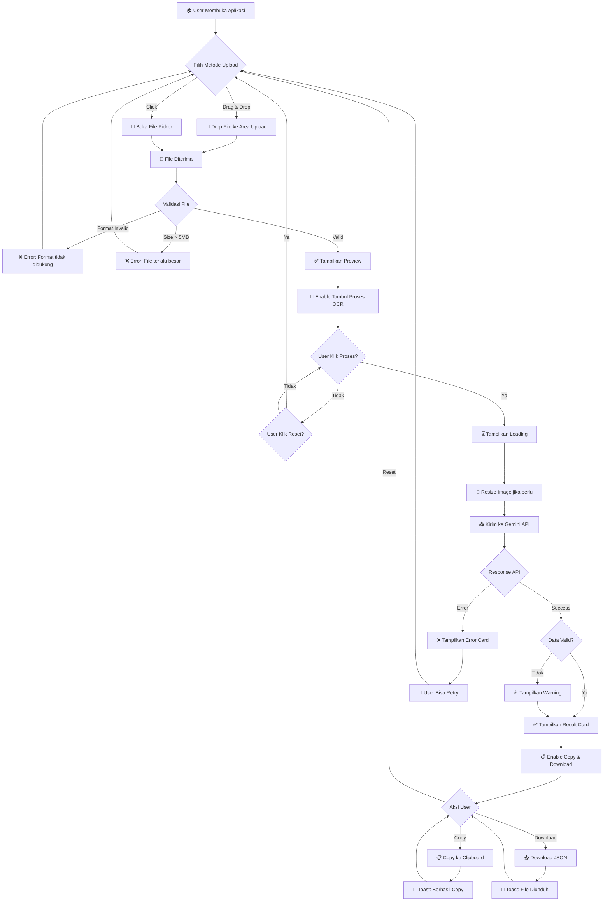
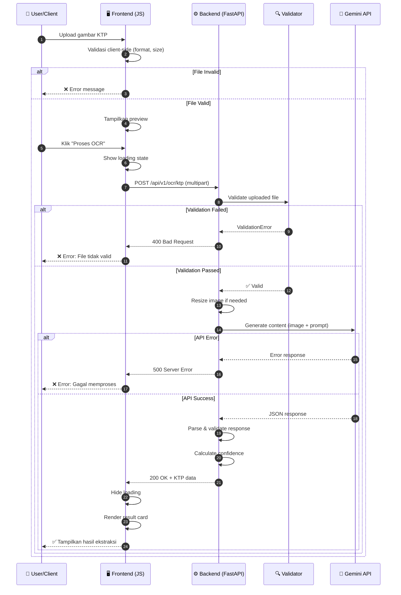
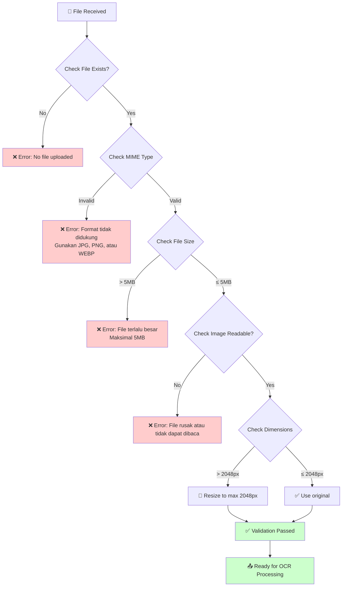
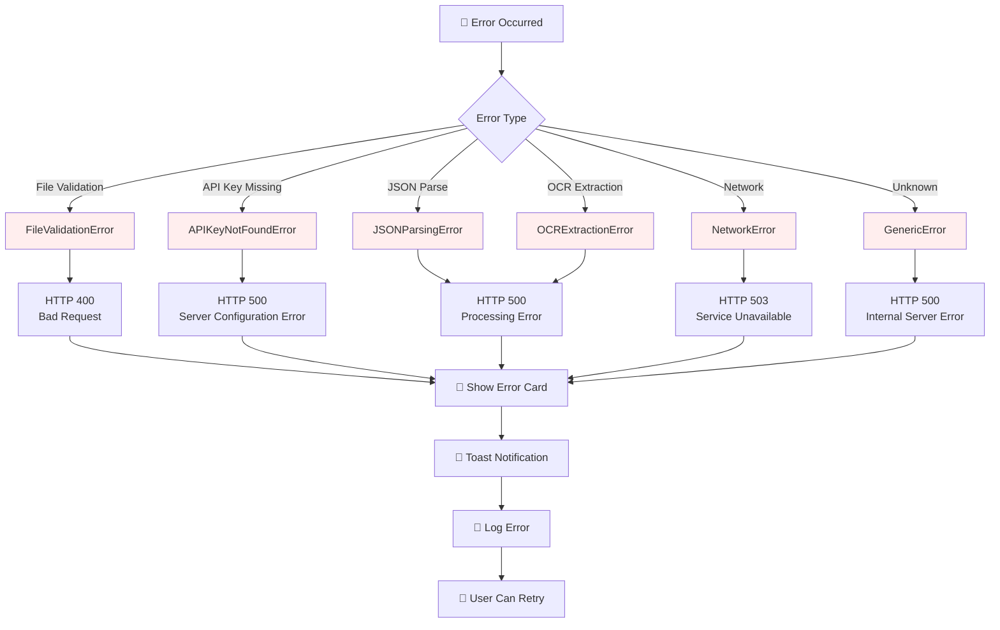
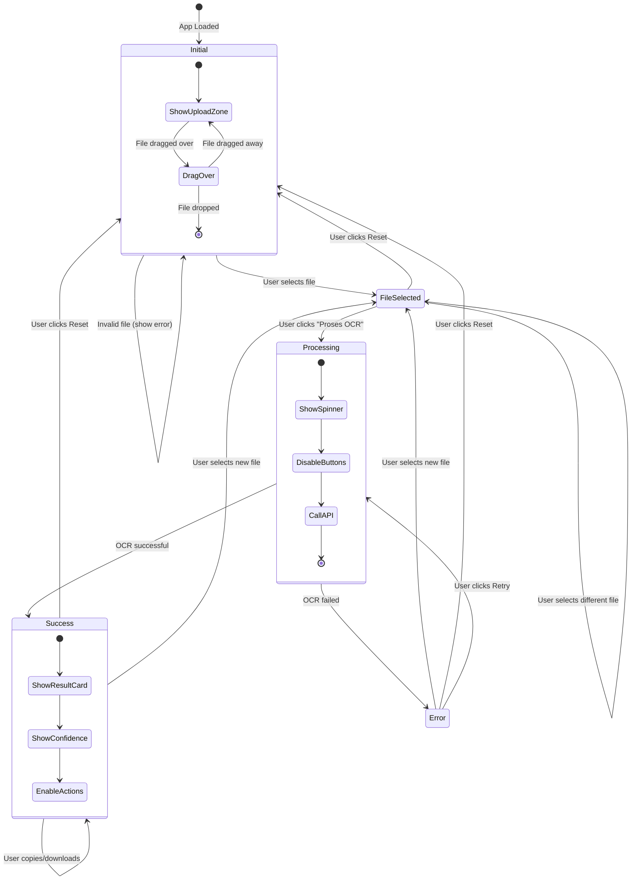
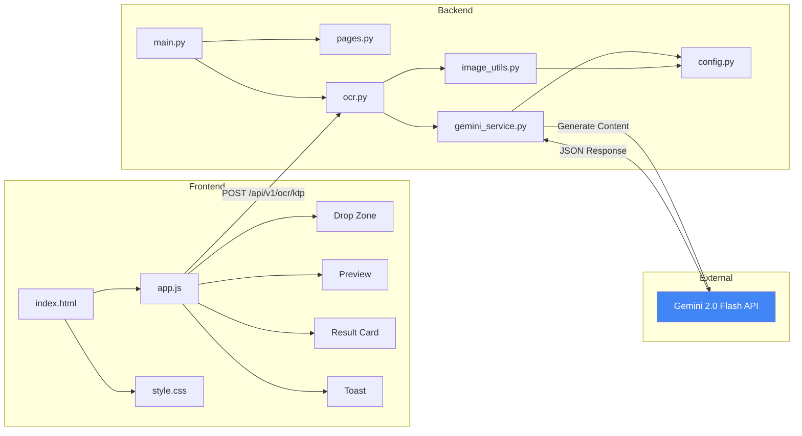

# Functional Specification Document (FSD)
# OCR KTP - Ekstraksi Data KTP Otomatis

**Versi:** 1.0  
**Tanggal:** 3 Desember 2025  
**Penulis:** System Analyst Team  
**Status:** Final

---

## 📋 Daftar Isi

1. [Ringkasan Eksekutif](#1-ringkasan-eksekutif)
2. [Deskripsi Sistem](#2-deskripsi-sistem)
3. [User Stories](#3-user-stories)
4. [Flowchart & Diagram](#4-flowchart--diagram)
5. [Spesifikasi Fungsional](#5-spesifikasi-fungsional)
6. [Non-Functional Requirements](#6-non-functional-requirements)
7. [Glossary](#7-glossary)

---

## 1. Ringkasan Eksekutif

### 1.1 Tujuan Dokumen
Dokumen ini menjelaskan spesifikasi fungsional lengkap untuk sistem **OCR KTP**, sebuah aplikasi web yang mengekstrak data dari foto Kartu Tanda Penduduk (KTP) Indonesia secara otomatis menggunakan teknologi AI (Google Gemini 2.0 Flash).

### 1.2 Scope
- Upload dan validasi gambar KTP
- Ekstraksi data menggunakan OCR berbasis AI
- Tampilan hasil ekstraksi dalam format terstruktur
- Fitur copy dan download hasil

### 1.3 Target Pengguna
| Persona | Deskripsi |
|---------|-----------|
| **End User** | Individu yang ingin mengekstrak data KTP dengan cepat |
| **Developer** | Integrasi via REST API ke sistem lain |
| **Admin** | Monitoring dan maintenance sistem |

---

## 2. Deskripsi Sistem

### 2.1 Overview
```
┌─────────────────────────────────────────────────────────────────┐
│                        OCR KTP System                           │
├─────────────────────────────────────────────────────────────────┤
│                                                                 │
│   ┌──────────┐     ┌──────────┐     ┌──────────┐               │
│   │   Web    │────▶│  FastAPI │────▶│  Gemini  │               │
│   │    UI    │◀────│  Backend │◀────│   API    │               │
│   └──────────┘     └──────────┘     └──────────┘               │
│                                                                 │
└─────────────────────────────────────────────────────────────────┘
```

### 2.2 Tech Stack
- **Frontend:** HTML5, TailwindCSS, Vanilla JavaScript
- **Backend:** Python 3.10+, FastAPI
- **AI Engine:** Google Gemini 2.0 Flash
- **Templating:** Jinja2

### 2.3 Data yang Diekstrak
| No | Field | Format | Keterangan |
|----|-------|--------|------------|
| 1 | NIK | 16 digit | Nomor Induk Kependudukan |
| 2 | Nama | Text (UPPERCASE) | Nama lengkap |
| 3 | Tempat Lahir | Text | Kota/Kabupaten kelahiran |
| 4 | Tanggal Lahir | DD-MM-YYYY | Tanggal lahir |
| 5 | Jenis Kelamin | LAKI-LAKI/PEREMPUAN | Gender |
| 6 | Alamat | Text | Alamat lengkap |
| 7 | RT/RW | XXX/XXX | Nomor RT dan RW |
| 8 | Kelurahan/Desa | Text | Nama kelurahan/desa |
| 9 | Kecamatan | Text | Nama kecamatan |
| 10 | Agama | Text | Agama |
| 11 | Status Perkawinan | Text | Status nikah |
| 12 | Pekerjaan | Text | Jenis pekerjaan |
| 13 | Kewarganegaraan | WNI/WNA | Kewarganegaraan |
| 14 | Berlaku Hingga | Date/SEUMUR HIDUP | Masa berlaku |

---

## 3. User Stories

### US-001: Upload Gambar KTP

**Sebagai** pengguna,  
**Saya ingin** mengupload gambar KTP melalui drag & drop atau file picker,  
**Agar** saya dapat mengekstrak data dari KTP tersebut.

#### Acceptance Criteria

| ID | Kriteria | Status |
|----|----------|--------|
| AC-001.1 | Sistem menerima file dengan format JPG, JPEG, PNG, atau WEBP | ✅ |
| AC-001.2 | Sistem menolak file dengan ukuran lebih dari 5MB dengan pesan error yang jelas | ✅ |
| AC-001.3 | Sistem menampilkan preview gambar setelah file dipilih | ✅ |
| AC-001.4 | Sistem mendukung drag & drop file ke area upload | ✅ |
| AC-001.5 | Sistem menampilkan nama file dan ukuran file yang dipilih | ✅ |
| AC-001.6 | Tombol "Proses OCR" aktif hanya setelah file valid dipilih | ✅ |

---

### US-002: Proses OCR KTP

**Sebagai** pengguna,  
**Saya ingin** memproses gambar KTP yang sudah diupload,  
**Agar** sistem mengekstrak semua data dari KTP secara otomatis.

#### Acceptance Criteria

| ID | Kriteria | Status |
|----|----------|--------|
| AC-002.1 | Sistem menampilkan loading indicator selama proses OCR | ✅ |
| AC-002.2 | Sistem menonaktifkan tombol submit selama proses berlangsung | ✅ |
| AC-002.3 | Sistem mengekstrak minimal 14 field data dari KTP | ✅ |
| AC-002.4 | Sistem menampilkan confidence score hasil ekstraksi | ✅ |
| AC-002.5 | Waktu proses tidak lebih dari 30 detik | ✅ |
| AC-002.6 | Sistem menampilkan pesan error jika proses gagal | ✅ |

---

### US-003: Lihat Hasil Ekstraksi

**Sebagai** pengguna,  
**Saya ingin** melihat hasil ekstraksi data KTP dalam format yang mudah dibaca,  
**Agar** saya dapat memverifikasi keakuratan data.

#### Acceptance Criteria

| ID | Kriteria | Status |
|----|----------|--------|
| AC-003.1 | Hasil ditampilkan dalam format tabel dengan label yang jelas | ✅ |
| AC-003.2 | Field yang tidak terbaca ditampilkan dengan tanda "-" | ✅ |
| AC-003.3 | Confidence score ditampilkan dengan warna (hijau ≥80%, kuning ≥50%, merah <50%) | ✅ |
| AC-003.4 | Hasil muncul dengan animasi slide-up yang smooth | ✅ |

---

### US-004: Copy Data ke Clipboard

**Sebagai** pengguna,  
**Saya ingin** menyalin hasil ekstraksi ke clipboard,  
**Agar** saya dapat paste ke aplikasi lain dengan mudah.

#### Acceptance Criteria

| ID | Kriteria | Status |
|----|----------|--------|
| AC-004.1 | Tombol copy tersedia di hasil ekstraksi | ✅ |
| AC-004.2 | Data disalin dalam format JSON yang valid | ✅ |
| AC-004.3 | Sistem menampilkan notifikasi toast setelah berhasil copy | ✅ |
| AC-004.4 | Fitur berfungsi di semua browser modern | ✅ |

---

### US-005: Download Hasil sebagai JSON

**Sebagai** pengguna,  
**Saya ingin** mengunduh hasil ekstraksi dalam format JSON,  
**Agar** saya dapat menyimpan atau menggunakan data untuk keperluan lain.

#### Acceptance Criteria

| ID | Kriteria | Status |
|----|----------|--------|
| AC-005.1 | Tombol download tersedia di hasil ekstraksi | ✅ |
| AC-005.2 | File diunduh dengan nama format `ktp_data_YYYY-MM-DD.json` | ✅ |
| AC-005.3 | File JSON berisi data lengkap termasuk confidence score | ✅ |
| AC-005.4 | File JSON terformat dengan indentasi yang rapi | ✅ |

---

### US-006: Reset Form

**Sebagai** pengguna,  
**Saya ingin** mereset form upload dan hasil,  
**Agar** saya dapat memproses KTP baru tanpa refresh halaman.

#### Acceptance Criteria

| ID | Kriteria | Status |
|----|----------|--------|
| AC-006.1 | Tombol reset tersedia setelah file dipilih | ✅ |
| AC-006.2 | Reset menghapus preview gambar | ✅ |
| AC-006.3 | Reset menghapus hasil ekstraksi | ✅ |
| AC-006.4 | Form kembali ke state awal (initial state) | ✅ |

---

### US-007: API Integration

**Sebagai** developer,  
**Saya ingin** mengakses fungsi OCR melalui REST API,  
**Agar** saya dapat mengintegrasikan dengan sistem lain.

#### Acceptance Criteria

| ID | Kriteria | Status |
|----|----------|--------|
| AC-007.1 | API endpoint tersedia di `POST /api/v1/ocr/ktp` | ✅ |
| AC-007.2 | API menerima multipart/form-data dengan field `file` | ✅ |
| AC-007.3 | Response dalam format JSON dengan struktur konsisten | ✅ |
| AC-007.4 | API documentation tersedia di `/docs` (Swagger UI) | ✅ |
| AC-007.5 | Health check endpoint tersedia di `/api/v1/ocr/health` | ✅ |

---

### US-008: Bantuan Penggunaan

**Sebagai** pengguna baru,  
**Saya ingin** melihat panduan cara menggunakan aplikasi,  
**Agar** saya dapat memahami cara kerja sistem dengan cepat.

#### Acceptance Criteria

| ID | Kriteria | Status |
|----|----------|--------|
| AC-008.1 | Tombol help (?) tersedia di header | ✅ |
| AC-008.2 | Modal help menampilkan langkah-langkah penggunaan | ✅ |
| AC-008.3 | Modal dapat ditutup dengan tombol close atau klik di luar modal | ✅ |
| AC-008.4 | Modal dapat ditutup dengan tombol Escape | ✅ |

---

## 4. Flowchart & Diagram

### 4.1 Main Application Flow



### 4.2 API Request Flow



### 4.3 File Validation Flow



### 4.4 Error Handling Flow



### 4.5 State Machine Diagram



### 4.6 Component Interaction Diagram



---

## 5. Spesifikasi Fungsional

### 5.1 Upload & Validasi

| ID | Fungsi | Input | Output | Validasi |
|----|--------|-------|--------|----------|
| F-001 | Upload file | File gambar | Preview gambar | Format, size |
| F-002 | Drag & drop | File dragged | Preview gambar | Format, size |
| F-003 | Validasi format | File | Boolean | JPG/JPEG/PNG/WEBP |
| F-004 | Validasi ukuran | File | Boolean | ≤ 5MB |
| F-005 | Resize gambar | Image bytes | Resized bytes | Max 2048px |

### 5.2 OCR Processing

| ID | Fungsi | Input | Output | Keterangan |
|----|--------|-------|--------|------------|
| F-006 | Extract KTP | Image bytes | KTPData | 14 fields |
| F-007 | Calculate confidence | KTPData | Float (0-1) | Filled fields / total |
| F-008 | Validate NIK | NIK string | Boolean | 16 digits |

### 5.3 Output & Actions

| ID | Fungsi | Input | Output | Keterangan |
|----|--------|-------|--------|------------|
| F-009 | Display result | KTPData | HTML table | Formatted |
| F-010 | Copy to clipboard | KTPData | Clipboard | JSON format |
| F-011 | Download JSON | KTPData | .json file | With timestamp |
| F-012 | Reset form | - | Initial state | Clear all |

---

## 6. Non-Functional Requirements

### 6.1 Performance

| Metric | Target | Keterangan |
|--------|--------|------------|
| Response time | < 10s | Waktu proses OCR |
| Page load | < 3s | Initial page load |
| File upload | < 2s | Upload time for 5MB |

### 6.2 Security

| Requirement | Implementation |
|-------------|----------------|
| No data storage | Gambar tidak disimpan di server |
| HTTPS ready | Support for SSL/TLS |
| API key protection | Environment variable |
| Input validation | Server-side validation |

### 6.3 Compatibility

| Browser | Minimum Version |
|---------|-----------------|
| Chrome | 90+ |
| Firefox | 88+ |
| Safari | 14+ |
| Edge | 90+ |

### 6.4 Accessibility

| Requirement | Status |
|-------------|--------|
| Keyboard navigation | ✅ |
| Screen reader support | ✅ |
| Color contrast | ✅ |
| Responsive design | ✅ |

---

## 7. Glossary

| Term | Definition |
|------|------------|
| **KTP** | Kartu Tanda Penduduk - Indonesian national ID card |
| **NIK** | Nomor Induk Kependudukan - 16-digit unique ID number |
| **OCR** | Optical Character Recognition - technology to extract text from images |
| **Gemini** | Google's multimodal AI model |
| **Confidence Score** | Percentage indicating extraction accuracy |
| **API** | Application Programming Interface |
| **JWT** | JSON Web Token (for future auth) |

---

## 📝 Revision History

| Version | Date | Author | Changes |
|---------|------|--------|---------|
| 1.0 | 2025-12-03 | System Analyst | Initial document |

---

**End of Document**
